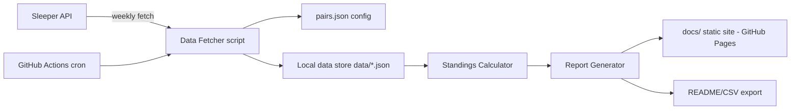

# Fantasy Football "Mentor League" App — Plan

## 1. Concept

A 10-team fantasy football league hosted on **Sleeper**, where teams are drafted normally but then
grouped into **5 pairs of 2 teams each** (1 "beginner" + 1 "expert"). Each pair's individual weekly
records (wins/losses/points) are **combined into a single pair record**, and a leaderboard of the 5
pairs is published to a website/document that auto-updates after each week's games are scored.

Example:
- Team A (expert) goes 1-0 (beats someone), Team B (beginner, paired with A) goes 0-1.
- Combined pair record for the week: 1-1 (or however the combination rule is defined — see §4).
- Pair standings are ranked separately from the normal Sleeper standings.

## 2. Official Ruleset (finalized)

**Format**
- 10 teams, one shared Sleeper draft. Teams split into 5 Beginners + 5 Experts.
- Commissioner manually pairs 1 Beginner + 1 Expert per pair, locked for the season
  (`config/pairs.json`) — no native "pairing" concept in Sleeper.
- Each team still plays its own independent weekly matchup via Sleeper's normal schedule
  (no custom schedule required).

**Weekly Scoring**
- A pair's weekly record = sum of both teammates' individual matchup results:
  - Both win → 2-0, split → 1-1, both lose → 0-2.
- **Upset Bonus**: if the Beginner beats an Expert opponent, that win counts as **1.5 wins**
  instead of 1 for the pair's weekly tally (bonus-only, no penalty when Experts win).
- **Pair-vs-pair edge case**: if two teammates are matched against each other (possible on a
  random schedule), it always nets to a 1-1 wash automatically — no special-casing needed.

**Season Standings**
- Ranked by total combined wins (with upset bonuses applied) across the season.
- **Tiebreaker**: total combined points-for across the season.

**Bonus / Fun Stats** (secondary, doesn't affect official standings)
- **Weighted Score** — `0.7 × Beginner's score + 0.3 × Expert's score` per pair per week, powering
  a separate "Top Mentee Performance" leaderboard/award. Weighting is configurable per league in
  `pairs.json` (default 70/30).
- **Weekly Awards** — auto-generated: Highest Combined Score, Biggest Blowout, Closest Match,
  Best Upset.
- **Beginner Leaderboard / Mentor Leaderboard** — separate rankings comparing the 5 Beginners
  against each other, and the 5 Experts against each other, by plain individual win % and
  points-for (no Upset Bonus applied — kept simple as a peer comparison, distinct from pair
  standings).

**Trades**
- Handled natively in Sleeper; the app just reads whatever roster/matchup state exists each week,
  no special trade logic needed.
- **League rule**: trades between the two teammates within the same pair are **disallowed** (or
  require extra commissioner scrutiny) — since their records are combined, a trade between
  partners isn't a genuine two-sided negotiation and creates a collusion risk. Trades between
  different pairs are normal and go through the usual Sleeper commissioner review/veto process.

**Playoffs**
- Top 4 pairs (by regular-season combined win record) qualify; 5th place is eliminated before
  playoffs start.
- 2-round bracket:
  - **Round 1 / Semifinal (Playoff Week 1)**: Seed 1 vs Seed 4, Seed 2 vs Seed 3.
  - **Round 2 / Final (Playoff Week 2)**: Winners play for the Mentor Cup.
- Each round's winner is decided by combined score (sum of both teammates' points that week),
  compared directly between the two paired opponents — a virtual head-to-head, since pairs never
  actually face each other in Sleeper's own individual schedule.
- Individual teams still compete separately in Sleeper's native playoff bracket for their own
  personal results; the pair bracket is a fully independent overlay computed by the app.

## 3. Key Requirements

1. Use the **Sleeper API** (read-only, no auth needed for public leagues) to pull:
   - League info, rosters, users
   - Matchups per week
   - Standings / points for
2. Support **manual pairing configuration** (commissioner assigns beginner↔expert pairs at draft time).
3. **Combine records** for each pair, week over week, into a running pair standings table.
4. **Export/publish** results automatically after each week to:
   - A static website (GitHub Pages), and/or
   - A generated document (Markdown/PDF/CSV)
5. Automate the weekly refresh (scheduled job / GitHub Action) so no manual re-running is needed.
6. Keep it simple, low/no-cost to run (this is a hobby league tool).

## 4. Assumptions (confirm/adjust as needed)

- League does not exist yet — must be created manually via the Sleeper app/website (commissioner
  flow); the public API is read-only and cannot create leagues. `league_id` is grabbed afterward.
- Pairing is fixed for the whole season once the draft happens (no re-pairing mid-season).
- Hosting the output on GitHub Pages is acceptable (free, simple, no server to maintain).
- No need to write back to Sleeper (Sleeper API is read-only for this use case anyway).
- Segregating the schedule so Beginners only ever face Beginners (and Experts only Experts) was
  considered but rejected for now — it requires manually editing the Sleeper schedule every week
  since the API can't set matchups. The Upset Bonus rule achieves a similar incentive without that
  ongoing manual burden.

## 5. Architecture



- **Language**: Python (simple scripting, great HTTP + templating support) or Node.js — pick one.
  Recommendation: **Python** (requests, jinja2) for simplicity.
- **No database needed** — store raw weekly snapshots as JSON files in `data/` for history/audit,
  and derived standings as JSON/CSV.
- **Static site generator**: simple Jinja2 → HTML, or Markdown table generator, published via
  GitHub Pages from `docs/`.
- **Automation**: GitHub Actions scheduled workflow (e.g., every Tuesday morning after MNF) that
  runs the fetch/calculate/publish pipeline and commits the updated site.

## 6. Project Structure

```
nfl/
├── plan.md                     (this file)
├── config/
│   └── pairs.json               # league_id, pair definitions, scoring mode
├── src/
│   ├── sleeper_client.py        # thin wrapper around Sleeper REST endpoints
│   ├── fetch_data.py             # pulls league/users/rosters/matchups, writes to data/
│   ├── standings.py               # computes weekly + cumulative pair standings
│   └── generate_report.py        # renders HTML/Markdown/CSV output
├── data/
│   ├── raw/                       # cached raw API responses per week
│   └── standings.json             # computed cumulative standings
├── templates/
│   └── standings.html.j2         # Jinja2 template for the site
├── docs/                          # published static site (GitHub Pages root)
│   └── index.html
├── .github/workflows/
│   └── weekly-update.yml         # cron job: fetch -> compute -> publish
└── requirements.txt
```

## 7. Sleeper API Endpoints Used

Base URL: `https://api.sleeper.app/v1`

| Purpose | Endpoint |
|---|---|
| League info | `GET /league/{league_id}` |
| Rosters (team -> owner, roster_id) | `GET /league/{league_id}/rosters` |
| Users in league | `GET /league/{league_id}/users` |
| Matchups for a week | `GET /league/{league_id}/matchups/{week}` |
| NFL state (current week) | `GET /state/nfl` |

No authentication required for public league data.

## 8. Implementation Steps

1. **Setup**
   - [ ] Create Sleeper league (or get `league_id` of existing one), confirm 10 teams drafted.
   - [ ] Initialize repo structure above, `requirements.txt` (requests, jinja2).
2. **Config**
   - [ ] Write `config/pairs.json`:
     ```json
     {
       "league_id": "123456789",
       "upset_bonus_multiplier": 1.5,
       "weighted_score": { "beginner_weight": 0.7, "expert_weight": 0.3 },
       "pairs": [
         { "name": "Pair 1", "beginner_roster_id": 1, "expert_roster_id": 6 },
         { "name": "Pair 2", "beginner_roster_id": 2, "expert_roster_id": 7 },
         { "name": "Pair 3", "beginner_roster_id": 3, "expert_roster_id": 8 },
         { "name": "Pair 4", "beginner_roster_id": 4, "expert_roster_id": 9 },
         { "name": "Pair 5", "beginner_roster_id": 5, "expert_roster_id": 10 }
       ]
     }
     ```
3. **Sleeper client** (`sleeper_client.py`): functions `get_league()`, `get_rosters()`,
   `get_users()`, `get_matchups(week)`, `get_current_week()`.
4. **Fetch script** (`fetch_data.py`): for the current (or specified) week, pull rosters/users/matchups,
   cache raw JSON under `data/raw/week_{n}.json`.
5. **Standings calculator** (`standings.py`):
   - Map roster_id → pair (and role: beginner/expert) using `pairs.json`.
   - For each teammate, look up their individual matchup result and opponent's role.
   - Sum wins/losses per pair; apply the Upset Bonus (1.5x) when a Beginner beats an Expert.
   - If two teammates faced each other, that week nets to 1-1 automatically (no special logic).
   - Compute Weighted Score per pair (`beginner_weight × beginner_pts + expert_weight × expert_pts`)
     for the secondary "Top Mentee Performance" leaderboard.
   - Accumulate into cumulative season standings (wins, losses, points for, points against),
     sorted by wins → total points-for tiebreaker.
   - Persist to `data/standings.json`.
6. **Report generator** (`generate_report.py`):
   - Render `templates/standings.html.j2` → `docs/index.html` with current standings + weekly history.
   - Also emit `docs/standings.csv` and/or a Markdown table for easy sharing.
7. **Automation**:
   - `.github/workflows/weekly-update.yml`: scheduled (`cron`) Tuesday ~09:00 UTC, runs
     `fetch_data.py` → `standings.py` → `generate_report.py`, commits changes to `docs/` and `data/`.
   - Enable GitHub Pages pointing at `docs/` branch/folder.
8. **Testing/validation**
   - [ ] Dry run against a real/test Sleeper league to confirm roster_id ↔ pair mapping is correct.
   - [ ] Verify a full week's combined scoring matches manual expectation.
9. **Polish (optional/stretch)**
   - [ ] Weekly Awards (Highest Combined Score, Biggest Blowout, Closest Match, Best Upset).
   - [ ] Slack/Discord webhook notification when the site updates.
   - [ ] Historical season archive if run across multiple seasons.

## 9. MVP Scope (day-1 build)

**In scope:**
- Sleeper client + fetch script (rosters, users, matchups).
- `pairs.json` config (filled in manually after the draft).
- Standings calculator implementing the Official Ruleset (§2): combined W/L, Upset Bonus,
  points-for tiebreaker, Weighted Score.
- One clean, mobile-friendly HTML page (simple CSS/Tailwind via CDN) showing pair standings +
  weekly results table.
- Manual "run the script" workflow — no GitHub Actions yet.

**Deferred to later:**
- GitHub Actions weekly cron automation.
- Weekly Awards / recap blurbs, Discord/Slack notifications.
- Historical multi-season archive.

## 10. Resolved Decisions

1. League does not exist yet — will be created manually via Sleeper app/website; `league_id`
   captured afterward.
2. Combination rule: Option 1 (combined W/L from real matchups) + Upset Bonus + Weighted Score,
   per the Official Ruleset in §2.
3. Output: GitHub Pages static site for MVP; Markdown/CSV export is a light lift to add later.
4. Python for the scripts.
5. Tiebreak: total combined points-for across the season.

## 11. Next Steps

Scaffold the repo per §6 and implement the MVP scope in §9.
